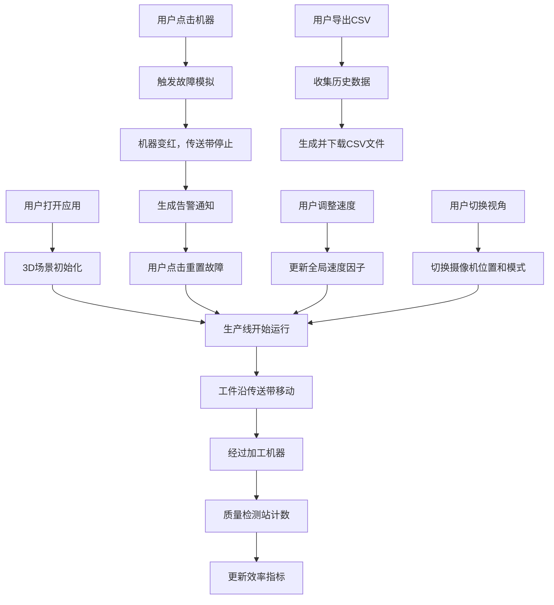

## 1. 产品概述

基于Three.js的3D数字孪生生产线监控看板，通过三维可视化方式实时展示生产线运行状态，支持故障模拟、效率分析和数据记录，为生产管理人员提供直观的决策支持工具。

- **核心价值**：将抽象的生产数据转化为直观的3D可视化场景，提升生产监控效率和故障响应速度
- **目标用户**：生产管理人员、车间主任、设备维护工程师
- **应用场景**：生产线实时监控、故障演练、效率分析、生产培训

## 2. 核心功能

### 2.1 用户角色
| 角色 | 注册方式 | 核心权限 |
|------|----------|----------|
| 生产管理员 | 无需注册，本地应用 | 查看监控、模拟故障、调整参数、导出数据 |

### 2.2 功能模块
1. **3D生产线场景**：传送带、加工机器、质量检测站、工件模型
2. **实时状态监控**：机器状态面板、运行/空闲/故障状态显示
3. **故障模拟系统**：点击触发故障、视觉告警、传送带停止
4. **参数控制面板**：速度调节（0.5x/1x/2x）、故障重置
5. **效率分析系统**：OEE计算、实时效率百分比、生产量统计
6. **数据记录模块**：CSV导出、小时生产量曲线图
7. **视角切换系统**：全局俯瞰视角、第一人称巡线视角
8. **告警系统**：顶部告警栏、实时告警显示

### 2.3 页面详情
| 页面名称 | 模块名称 | 功能描述 |
|---------|----------|----------|
| 主监控页面 | 3D场景区域 | 展示完整生产线3D模型，支持旋转、缩放、平移交互 |
| 主监控页面 | 顶部告警栏 | 显示当前活跃告警，支持点击定位故障设备 |
| 主监控页面 | 右侧控制面板 | 速度调节按钮、故障重置按钮、视角切换按钮、CSV导出按钮 |
| 主监控页面 | 底部效率面板 | 显示OEE指标、当前效率、今日产量、运行时间统计 |
| 主监控页面 | 机器状态面板 | 悬浮于每个机器上方，显示状态、加工数量、效率 |
| 主监控页面 | 生产量曲线图 | 显示过去一小时生产量变化趋势 |

## 3. 核心流程

### 3.1 正常生产流程
用户打开应用 → 3D场景加载完成 → 生产线自动开始运行 → 工件从传送带上依次经过各加工机器 → 质量检测站检测 → 完成生产计数 → 实时更新效率指标

### 3.2 故障模拟流程
用户点击某台机器 → 机器状态变为故障（变红）→ 传送带停止 → 工件在故障机器前堆积 → 顶部生成告警通知 → 效率指标下降 → 用户点击重置故障 → 生产线恢复运行

### 3.3 数据导出流程
用户点击导出CSV按钮 → 系统收集生产历史数据 → 生成CSV文件 → 自动下载到本地

### 3.4 Mermaid流程图

## 4. 用户界面设计

### 4.1 设计风格
- **主色调**：工业蓝（#165DFF）作为主色，深灰（#1D2129）作为背景，科技感十足
- **辅助色**：绿色（#00B42A）表示运行，黄色（#FF7D00）表示空闲，红色（#F53F3F）表示故障
- **视觉风格**：赛博朋克工业风，深色背景配合霓虹光效，HUD风格UI元素
- **按钮风格**：圆角矩形，带发光边框效果，悬停时有亮度变化
- **字体**：使用 JetBrains Mono 作为数字字体，Inter 作为界面字体
- **布局风格**：半透明磨砂玻璃效果面板，悬浮布局，不遮挡3D场景

### 4.2 页面设计概述
| 页面名称 | 模块名称 | UI元素 |
|---------|----------|--------|
| 主监控页面 | 3D场景区域 | 全屏幕3D渲染，带网格地面和工业环境光 |
| 主监控页面 | 顶部告警栏 | 固定顶部，半透明背景，告警条目从右向左滑入动画 |
| 主监控页面 | 右侧控制面板 | 垂直排列按钮组，图标+文字，带激活状态指示 |
| 主监控页面 | 底部效率面板 | 多数据卡片横向排列，带微妙渐变边框 |
| 主监控页面 | 机器状态面板 | 悬浮文字标签，背景半透明，状态色边框 |
| 主监控页面 | 生产量曲线图 | 半透明背景，平滑曲线，渐变填充 |

### 4.3 响应式
- **桌面优先**：针对1920x1080及以上分辨率优化
- **自适应**：控制面板在小屏幕上自动调整位置和大小
- **触控支持**：3D场景支持触控旋转缩放，按钮尺寸适配触控操作

### 4.4 3D场景指引
- **环境设置**：深色工业环境，蓝色网格地面，带雾气效果增加纵深感
- **光照设置**：主光源为冷白色平行光，配合蓝色环境光，机器自带发光材质
- **摄像机设置**：默认俯瞰视角45度俯角，第一人称视角沿传送带轨道移动
- **焦点元素**：加工机器为视觉焦点，使用金属材质和发光边缘
- **交互动画**：工件移动有平滑动画，机器运行时有呼吸灯效，故障时有闪烁效果
- **后处理效果**：轻微Bloom效果增强发光感，FXAA抗锯齿
- **性能控制**：控制多边形数量，使用实例化渲染处理多个工件，目标帧率60fps
