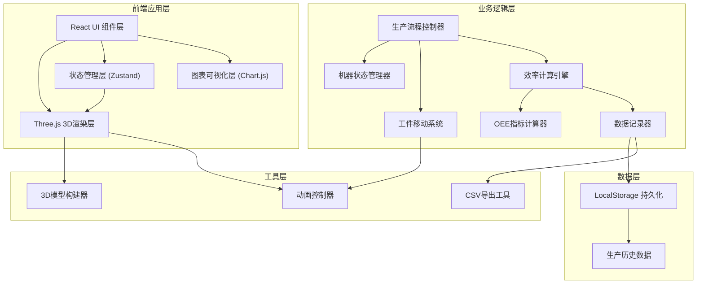

## 1. 架构设计



## 2. 技术描述

- **前端框架**: React 18 + TypeScript
- **构建工具**: Vite 5
- **样式方案**: TailwindCSS 3
- **3D引擎**: Three.js 0.160 + @react-three/fiber 8 + @react-three/drei 9
- **后处理**: @react-three/postprocessing 2
- **状态管理**: Zustand 4
- **图表库**: Chart.js 4 + react-chartjs-2 5
- **字体**: Inter (界面), JetBrains Mono (数字显示)

## 3. 核心技术选型说明

### 3.1 3D渲染技术栈
- **@react-three/fiber**: 将Three.js封装为React组件，便于状态驱动3D场景
- **@react-three/drei**: 提供常用3D组件（OrbitControls、Text、TransformControls等）
- **@react-three/postprocessing**: 实现Bloom泛光、FXAA抗锯齿等后处理效果

### 3.2 状态管理
- **Zustand**: 轻量级状态管理，避免Redux的繁琐，适合3D场景的高频状态更新

### 3.3 性能优化策略
- **实例化渲染**: 使用InstancedMesh渲染多个工件，减少Draw Call
- **对象池**: 复用工件对象，避免频繁创建销毁
- **帧率控制**: 固定60fps逻辑更新，渲染帧率自适应
- **LOD**: 远处物体降低细节级别

## 4. 目录结构

```
src/
├── components/
│   ├── ui/                      # 普通UI组件
│   │   ├── AlertBar.tsx         # 顶部告警栏
│   │   ├── ControlPanel.tsx     # 右侧控制面板
│   │   ├── EfficiencyPanel.tsx  # 底部效率面板
│   │   ├── ProductionChart.tsx  # 生产量曲线图
│   │   └── MachineStatusTag.tsx # 机器状态标签
│   └── three/                   # 3D场景组件
│       ├── Scene.tsx            # 主场景容器
│       ├── ProductionLine.tsx   # 生产线组合组件
│       ├── ConveyorBelt.tsx     # 传送带组件
│       ├── Machine.tsx          # 加工机器组件
│       ├── InspectionStation.tsx# 质量检测站
│       ├── Workpiece.tsx        # 工件组件
│       └── Floor.tsx            # 地面网格
├── store/
│   └── useProductionStore.ts    # 生产状态管理
├── types/
│   └── production.ts            # 类型定义
├── utils/
│   ├── csvExporter.ts           # CSV导出工具
│   ├── efficiencyCalculator.ts  # 效率计算工具
│   └── constants.ts             # 常量配置
├── hooks/
│   ├── useProductionLoop.ts     # 生产循环Hook
│   └── useFirstPersonCamera.ts  # 第一人称相机Hook
├── App.tsx
├── main.tsx
└── index.css
```

## 5. 核心数据类型定义

```typescript
// 机器状态枚举
type MachineStatus = 'running' | 'idle' | 'fault';

// 机器接口
interface Machine {
  id: string;
  name: string;
  position: [number, number, number];
  status: MachineStatus;
  processedCount: number;
  efficiency: number;
  faultTime: number | null;
}

// 工件接口
interface Workpiece {
  id: string;
  position: [number, number, number];
  progress: number; // 0-1 沿传送带进度
  processed: boolean;
  inspected: boolean;
  passed: boolean;
}

// 告警接口
interface Alert {
  id: string;
  machineId: string;
  message: string;
  timestamp: number;
  severity: 'warning' | 'critical';
}

// 生产记录接口
interface ProductionRecord {
  timestamp: number;
  count: number;
  efficiency: number;
  oee: number;
  faultDuration: number;
}

// 全局生产状态
interface ProductionState {
  machines: Machine[];
  workpieces: Workpiece[];
  alerts: Alert[];
  productionHistory: ProductionRecord[];
  globalSpeed: number; // 0.5, 1, 2
  isRunning: boolean;
  totalProduced: number;
  totalFaultTime: number;
  totalRunTime: number;
  currentOEE: number;
  currentEfficiency: number;
  cameraMode: 'overview' | 'firstPerson';
}
```

## 6. 核心算法说明

### 6.1 OEE计算算法
```typescript
// OEE = 可用率 × 性能率 × 质量率
// 可用率 = (计划运行时间 - 停机时间) / 计划运行时间
// 性能率 = (理想节拍 × 实际产量) / 运行时间
// 质量率 = 合格数量 / 总数量

function calculateOEE(
  plannedRunTime: number,
  faultTime: number,
  actualOutput: number,
  idealCycleTime: number,
  runTime: number,
  goodCount: number,
  totalCount: number
): number {
  const availability = (plannedRunTime - faultTime) / plannedRunTime;
  const performance = (idealCycleTime * actualOutput) / runTime;
  const quality = goodCount / totalCount;
  return availability * performance * quality;
}
```

### 6.2 工件移动算法
- 使用参数化路径，每个工件维护0-1的progress值
- 根据全局速度因子和deltaTime更新progress
- progress映射到传送带贝塞尔曲线上的实际位置
- 碰撞检测：前方工件距离小于阈值时停止移动

### 6.3 效率实时计算
- 每5秒记录一次生产量快照
- 滑动窗口计算过去1小时的平均生产速率
- 效率 = 实际生产速率 / 理论最大生产速率 × 100%

## 7. 性能优化方案

| 优化点 | 方案 | 预期收益 |
|--------|------|----------|
| 大量工件渲染 | InstancedMesh批量渲染 | Draw Call从N减少到1 |
| 状态更新频率 | 逻辑更新60fps，UI更新10fps | CPU占用减少50% |
| 内存管理 | 工件对象池复用 | GC频率降低80% |
| 后处理效果 | 条件开启Bloom，移动端关闭 | 帧率提升15-20fps |
| 相机控制 | 第一人称模式禁用OrbitControls | 减少不必要的矩阵计算 |

## 8. 开发规范

- **组件命名**: 3D组件前缀Three-，普通UI组件无前缀
- **状态更新**: 所有3D场景状态通过Zustand store驱动，禁止直接操作Three.js对象
- **TypeScript**: 严格模式，禁止any类型
- **样式**: 使用TailwindCSS utility class，自定义样式使用tw-colors插件
- **Git提交**: Conventional Commits规范
